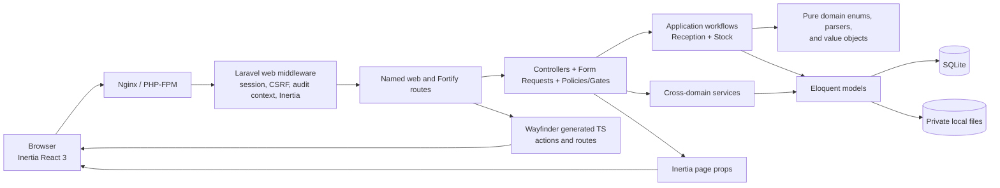
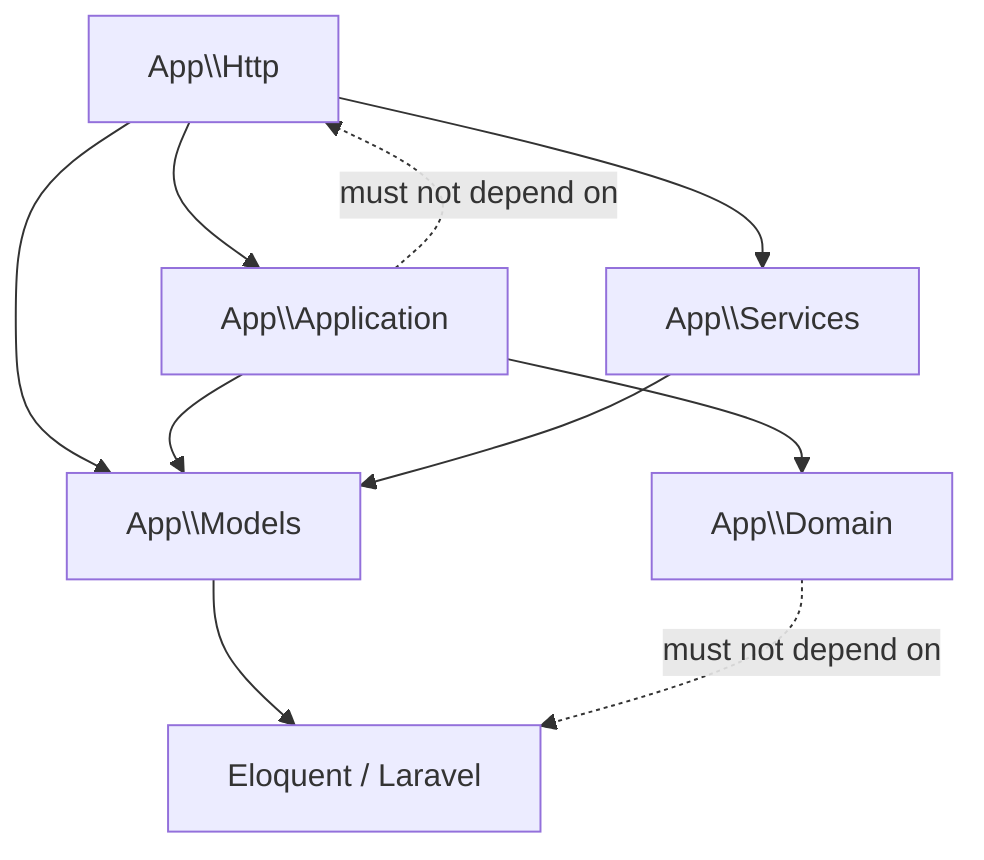

# Architecture

Last verified: 2026-07-30

## System summary

iianka is a private, server-rendered SPA for internal operations. Laravel owns routing,
authentication, authorization, validation, transactions, persistence, and Inertia page props.
React owns the interactive UI. There is no public JSON API and no `routes/api.php`.

## Runtime and toolchain

| Concern                                 | Current family                                      | Authoritative source                                                         |
| --------------------------------------- | --------------------------------------------------- | ---------------------------------------------------------------------------- |
| Runtime                                 | PHP 8.5, Laravel 13                                 | `composer.json`, `composer.lock`                                             |
| Server adapter                          | Inertia Laravel 3                                   | `composer.lock`                                                              |
| Authentication                          | Fortify 1, Laravel Passkeys                         | `config/fortify.php`, lockfiles                                              |
| Client                                  | React 19, Inertia React 3, TypeScript               | `package.json`, `package-lock.json`                                          |
| Styling                                 | Tailwind CSS 4                                      | `package-lock.json`, `resources/css/app.css`                                 |
| Bundling                                | Vite 8, React Compiler                              | `vite.config.ts`                                                             |
| Typed routes                            | Laravel Wayfinder                                   | `vite.config.ts`, generated `resources/js/actions` and `resources/js/routes` |
| Persistence                             | SQLite                                              | `config/database.php`, migrations                                            |
| Local cache/session/queue defaults      | Database-backed                                     | `.env.example`, relevant config files                                        |
| Intended production cache/session/queue | Redis                                               | `SERVER_SETUP.md`                                                            |
| Tests                                   | Pest 4, PHPUnit 12, Playwright                      | `tests`, `e2e`, configuration files                                          |
| Static analysis                         | PHPStan/Larastan, Psalm, Rector, ESLint, TypeScript | Composer/npm scripts and CI                                                  |

Use the lockfiles for exact versions. Do not copy a version from this document into dependency
constraints.

## Architectural boundaries

### Domain layer

`app/Domain` contains business types that are independent of delivery and persistence:

- Reception enums.
- Stock enums, parser data objects, parsing logic, and value objects.

`tests/Unit/DomainArchitectureTest.php` enforces that this layer does not depend on
`App\Application`, `App\Http`, `App\Models`, Illuminate database/HTTP classes, or facades.

### Application layer

`app/Application` owns multi-step, transaction-sensitive use cases:

- `ReceptionCaseNumberGenerator`
- `ReceptionCaseWorkflow`
- `ScheduleStockReconciliationService`
- `StockPurchaseRecorder`
- `StockTermReportService`

The same architecture test prevents this layer from depending on `App\Http`. Application services
may coordinate models and domain objects, but must not know about requests, responses, or Inertia.

### Delivery layer

`app/Http` contains:

- Controllers and invokable controllers.
- Form Requests for normalization, authorization, and validation.
- Policies and gates.
- Inertia presenters and query helpers.
- Middleware for audit request IDs, appearance, shared props, proxy-aware behavior, and indexing
  prevention.

Controllers should use validated input and named routes. Reception transitions and stock ledger
mutations belong in their existing application services, not inline controller code.

### Persistence layer

`app/Models` contains Eloquent models. The codebase uses Laravel PHP attributes such as
`#[Fillable]`, `#[Hidden]`, and `#[Scope]`, typed relationships, `casts()` methods, and model
observers.

Important persistence behavior:

- Reception transitions and stock updates use transactions and row locks.
- `StockTransaction` rows are immutable by model hooks.
- `ConstructionSubcontractor` uses soft deletes; schedule relations include trashed records.
- Attachment and site-guide models delete their stored files when the model is deleted.
- `AuditLogger` is best-effort: it catches write failures, logs them, and does not fail the business
  request.

### Cross-domain services

`app/Services` contains shared application services:

- `BusinessDate` fixes the business calendar to `Asia/Tokyo`.
- `ScheduleCalendarService` composes schedule and cleaning-duty calendar data.
- `ScheduleFormOptionsService` builds user/attendance/contractor choices.
- `AuditLogger` records sanitized security and business events.

Laravel's configured timezone is UTC. Date-only business decisions must use `BusinessDate`, not
`now()->toDateString()` in the application timezone.

## Domain/module map

| Module                    | Backend entry points                                                                                                     | Core data                                                                         | Primary React pages                                                                    |
| ------------------------- | ------------------------------------------------------------------------------------------------------------------------ | --------------------------------------------------------------------------------- | -------------------------------------------------------------------------------------- |
| Schedule calendar/search  | `ConstructionScheduleController`, `BusinessScheduleController`, `ScheduleOverviewController`, `ScheduleSearchController` | Construction/business schedules, assignments, guide files, subcontractors         | `construction-schedules`, `business-schedules`, `schedule-overview`, `schedule-search` |
| Attendance                | `AttendanceRecordController`                                                                                             | Attendance records and users                                                      | `attendance-records/index`                                                             |
| Internal communication    | `InternalNoticeController`, `CleaningDutyRuleController`                                                                 | Notices, cleaning rules, user pivots                                              | `internal-notices`, `cleaning-duty-rules`                                              |
| Voucher confirmation      | `ConstructionScheduleVoucherController`                                                                                  | Construction voucher fields                                                       | `voucher-confirmations/index`                                                          |
| Reception                 | Reception controllers under `app/Http/Controllers`, `ReceptionCaseWorkflow`                                              | Cases, document types, activities, attachments, seen states, daily sequence       | `reception/home`, `reception/cases`, `reception/archive`, `reception/document-types`   |
| Stock                     | Admin stock controllers, reconciliation/purchase/report services                                                         | Stocks, aliases, revisions, mentions, balances, immutable transactions, purchases | `admin/stocks` plus construction schedule content editor                               |
| Identity/settings         | Fortify, settings controllers, admin user controller                                                                     | Users, passkeys, sessions, reset tokens                                           | `auth`, `settings`, `admin/users`                                                      |
| Audit                     | `AuditLogger`, `AuditLogController`, middleware/listeners                                                                | Audit logs                                                                        | `admin/audit-logs/index`                                                               |
| Construction site library | `ConstructionSiteController`, `SiteGuideFileController`                                                                  | Site guide metadata/files                                                         | `construction-sites`                                                                   |

## Request and page flow

1. The `web` middleware stack establishes the session and CSRF protection.
2. `AssignAuditRequestContext` attaches a request ID.
3. `HandleAppearance` reads the appearance cookie.
4. `HandleInertiaRequests` shares application name, authenticated user, role-derived permissions,
   sidebar state, attention counts, and reception enum labels.
5. A named route resolves a controller. Most business routes require `auth` and `verified`.
6. A Form Request normalizes, authorizes, and validates mutations.
7. The controller uses gates/policies and delegates transaction-sensitive behavior.
8. The controller returns an Inertia page or redirects with scoped flash data.
9. React pages submit through Inertia using generated Wayfinder action/route objects.

The application-wide page layout is selected in `resources/js/app.tsx`:

- `welcome` has no layout.
- `auth/*` uses the auth layout.
- `settings/*` nests the app and settings layouts.
- All other pages use the app sidebar layout.

## Frontend structure

| Path                         | Responsibility                                           |
| ---------------------------- | -------------------------------------------------------- |
| `resources/js/pages`         | Route-level Inertia pages                                |
| `resources/js/components`    | Shared application components                            |
| `resources/js/components/ui` | Reusable UI primitives                                   |
| `resources/js/hooks`         | Reusable client behavior                                 |
| `resources/js/lib`           | Pure or mostly pure helpers and shared page logic        |
| `resources/js/layouts`       | App, auth, and settings layouts                          |
| `resources/js/types`         | Shared TypeScript contracts                              |
| `resources/js/actions`       | Generated Wayfinder controller actions; do not hand-edit |
| `resources/js/routes`        | Generated Wayfinder named routes; do not hand-edit       |
| `resources/js/wayfinder`     | Generated Wayfinder support; do not hand-edit            |

Wayfinder form variants are enabled in `vite.config.ts`. Use imports from `@/actions` or
`@/routes` instead of hardcoded application URLs.

## Infrastructure behavior

- The health endpoint is `/up`.
- Search indexing is denied both by middleware and the `robots.txt` route.
- The application trusts forwarded headers from all proxies; edge/server configuration is part of
  the trust boundary.
- The default queue, session, and cache drivers are database-backed locally.
- Queue tables exist, but there are currently no custom jobs under `app/Jobs`.
- The server topology provisions a scheduler service, but `php artisan schedule:list` currently
  reports no scheduled tasks.
- User-controlled reception attachments and new site guide files are stored on the private
  `local` disk and served through authenticated controllers.

## Dependency direction

When adding a feature, preserve these directions and extend
`tests/Unit/DomainArchitectureTest.php` if a new boundary becomes important.
