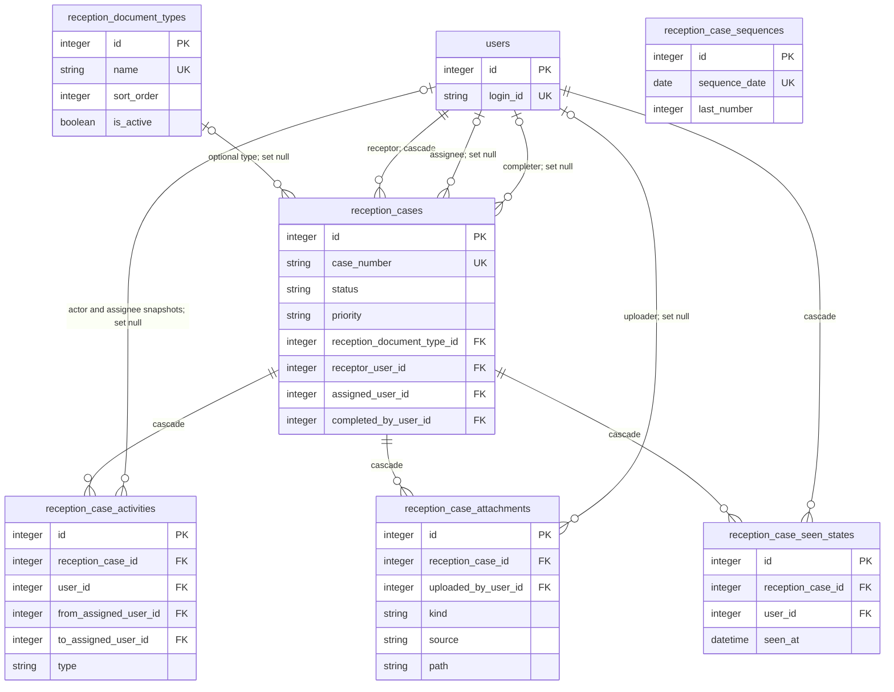
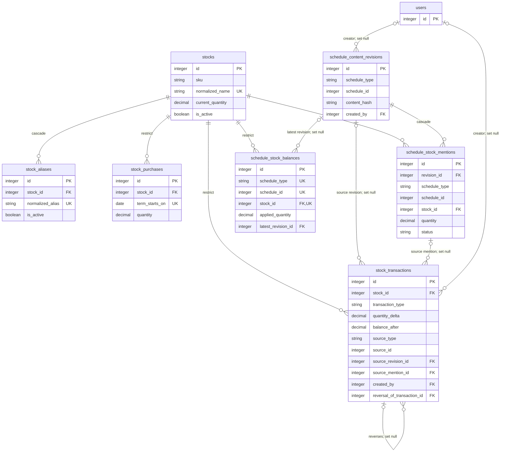
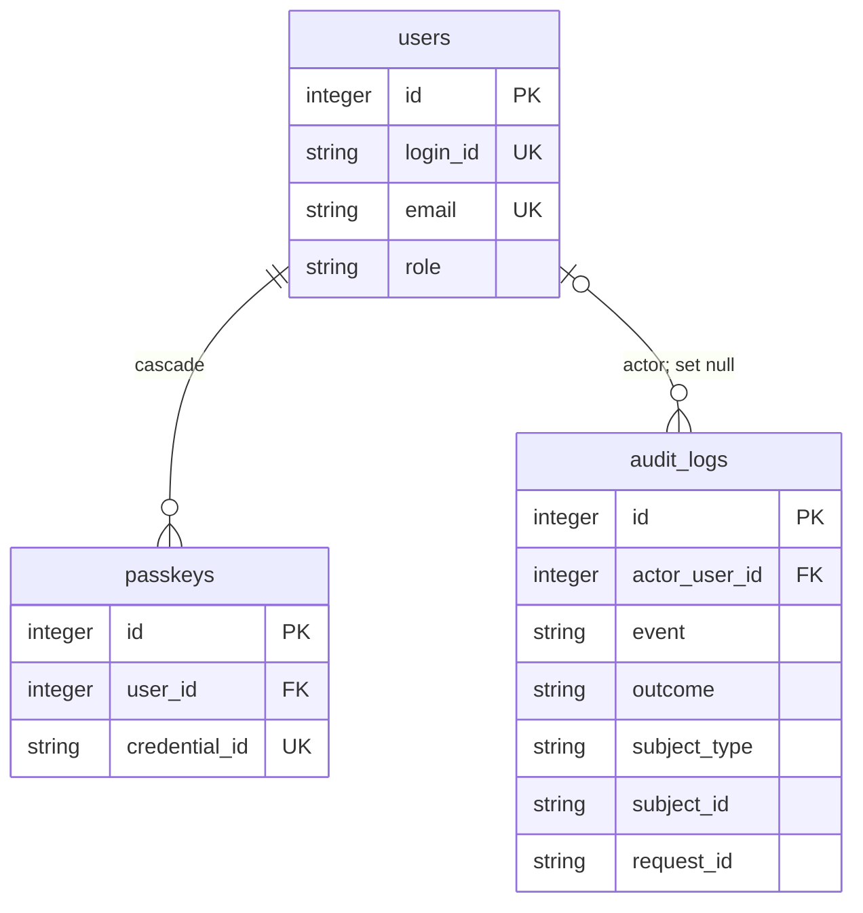

# Database ERD

Last verified: 2026-07-30

## Scope and source

This document describes the physical schema produced by running all current migrations into a
fresh SQLite database. That schema contains 38 application and framework tables and passes
`PRAGMA foreign_key_check`.

Migrations are the schema source of truth. Models describe application-level relationships and
casts; the developer's existing `database/database.sqlite` may contain local drift.

Legend:

- Solid ERD edges are physical foreign keys.
- Labels include important `ON DELETE` behavior.
- `schedule_type` + `schedule_id`, audit subjects, session users, and password-reset email links are
  logical references without database foreign keys. They are listed separately.
- Diagrams show key columns, not every payload or timestamp column.

## Scheduling, attendance, and communication

```mermaid
erDiagram
    users {
        integer id PK
        string login_id UK
        string email UK
        string role
    }
    construction_schedules {
        integer id PK
        date scheduled_on
        integer schedule_number
        string status
        integer voucher_checked_by_user_id FK
    }
    construction_schedule_user {
        integer construction_schedule_id PK, FK
        integer user_id PK, FK
    }
    construction_subcontractors {
        integer id PK
        string name
        datetime deleted_at
    }
    construction_schedule_subcontractor {
        integer construction_schedule_id PK, FK
        integer construction_subcontractor_id PK, FK
    }
    site_guide_files {
        integer id PK
        string name UK
        string disk
        string path
    }
    construction_schedule_site_guide_file {
        integer construction_schedule_id PK, FK
        integer site_guide_file_id PK, FK
    }
    business_schedules {
        integer id PK
        date scheduled_on
        integer schedule_number
    }
    business_schedule_user {
        integer business_schedule_id PK, FK
        integer user_id PK, FK
    }
    internal_notices {
        integer id PK
        date scheduled_on
        string title
    }
    internal_notice_user {
        integer internal_notice_id PK, FK
        integer user_id PK, FK
    }
    cleaning_duty_rules {
        integer id PK
        integer weekday
        boolean is_active
    }
    cleaning_duty_rule_user {
        integer cleaning_duty_rule_id PK, FK
        integer user_id PK, FK
    }
    attendance_records {
        integer id PK
        integer user_id FK
        date work_date UK
        string status
    }

    users o|--o{ construction_schedules : "voucher checker; set null"
    users ||--o{ construction_schedule_user : "assignment; cascade"
    construction_schedules ||--o{ construction_schedule_user : "assignment; cascade"
    construction_schedules ||--o{ construction_schedule_subcontractor : "cascade"
    construction_subcontractors ||--o{ construction_schedule_subcontractor : "cascade"
    construction_schedules ||--o{ construction_schedule_site_guide_file : "cascade"
    site_guide_files ||--o{ construction_schedule_site_guide_file : "cascade"
    users ||--o{ business_schedule_user : "assignment; cascade"
    business_schedules ||--o{ business_schedule_user : "assignment; cascade"
    users ||--o{ internal_notice_user : "audience; cascade"
    internal_notices ||--o{ internal_notice_user : "audience; cascade"
    users ||--o{ cleaning_duty_rule_user : "assignment; cascade"
    cleaning_duty_rules ||--o{ cleaning_duty_rule_user : "assignment; cascade"
    users ||--o{ attendance_records : "cascade"
```



`general_contractors` is a unique name catalog populated from schedule form activity.
Construction and business schedules store the contractor as a denormalized string; there is no
foreign key to the catalog.

## Reception



`reception_case_sequences` has no foreign key. It serializes the daily number used in
`reception_cases.case_number`.

## Stock



The stock schema deliberately preserves history:

- Stock deletion is restricted while purchases, mentions, balances, or ledger rows reference it.
- Ledger transactions are immutable at the model layer.
- Deleting a construction schedule reverses applied usage and removes active balances while
  retaining revisions, mentions, and transactions.

## Identity, audit, and framework support



Framework support tables:

| Tables                               | Purpose                                                                  |
| ------------------------------------ | ------------------------------------------------------------------------ |
| `password_reset_tokens`              | Fortify/Laravel password reset tokens, keyed by email without a user FK  |
| `sessions`                           | Database session store locally; `user_id` is indexed but not constrained |
| `cache`, `cache_locks`               | Database cache and atomic locks locally                                  |
| `jobs`, `job_batches`, `failed_jobs` | Database queue support                                                   |
| `migrations`                         | Applied migration ledger                                                 |

Production is intended to move cache, sessions, and queues to Redis while retaining SQLite as the
primary application database.

## Table catalog and key constraints

### Scheduling and communication

| Table                                   | Purpose                                                | Important constraints                                                                         |
| --------------------------------------- | ------------------------------------------------------ | --------------------------------------------------------------------------------------------- |
| `construction_schedules`                | Field-work schedule and voucher/stock extraction state | Indexes on date, status, and `(scheduled_on, schedule_number)`; schedule number is not unique |
| `construction_schedule_user`            | Assigned users                                         | Composite primary key; both FKs cascade                                                       |
| `construction_subcontractors`           | Reusable subcontractors                                | Soft deletes; name and phone indexed                                                          |
| `construction_schedule_subcontractor`   | Schedule/subcontractor link                            | Composite primary key; both FKs cascade                                                       |
| `site_guide_files`                      | Stored construction guide metadata                     | Unique display name                                                                           |
| `construction_schedule_site_guide_file` | Schedule/guide link                                    | Composite primary key; both FKs cascade                                                       |
| `business_schedules`                    | Non-construction schedule                              | Date and `(date, number)` indexes; number is not unique                                       |
| `business_schedule_user`                | Assigned users                                         | Composite primary key; both FKs cascade                                                       |
| `internal_notices`                      | Dated internal announcements                           | Scheduled date index                                                                          |
| `internal_notice_user`                  | Notice audience                                        | Composite primary key; both FKs cascade                                                       |
| `cleaning_duty_rules`                   | Recurring weekday duty                                 | Weekday and active indexes                                                                    |
| `cleaning_duty_rule_user`               | Assigned users                                         | Composite primary key; both FKs cascade                                                       |
| `attendance_records`                    | Per-user working/leave status                          | Unique `(user_id, work_date)`                                                                 |
| `general_contractors`                   | Unique contractor-name suggestion catalog              | No FK from schedules                                                                          |

### Reception

| Table                        | Purpose                            | Important constraints                                                                                      |
| ---------------------------- | ---------------------------------- | ---------------------------------------------------------------------------------------------------------- |
| `reception_cases`            | Intake case and workflow state     | Unique case number; indexes support status, priority, assignee, due/scheduled dates, activity, and archive |
| `reception_document_types`   | Ordered active/inactive case types | Unique name; active and order indexes                                                                      |
| `reception_case_sequences`   | Daily case-number counter          | Unique sequence date                                                                                       |
| `reception_case_activities`  | Append-oriented case timeline      | Case cascades; user snapshots become null                                                                  |
| `reception_case_attachments` | Private file metadata              | Case cascades; uploader becomes null; case/kind and case/source indexes                                    |
| `reception_case_seen_states` | Last-seen state per user/case      | Unique `(reception_case_id, user_id)`; both FKs cascade                                                    |

### Stock

| Table                        | Purpose                                       | Important constraints                                                           |
| ---------------------------- | --------------------------------------------- | ------------------------------------------------------------------------------- |
| `stocks`                     | Stock master and materialized current balance | Unique normalized name; active and SKU indexes                                  |
| `stock_aliases`              | Alternate parser names                        | Globally unique normalized alias; stock cascades                                |
| `stock_purchases`            | One purchased total per stock/accounting term | Unique `(stock_id, term_starts_on)`; stock delete restricted                    |
| `schedule_content_revisions` | Parsed content snapshots                      | Logical schedule pointer; creator becomes null                                  |
| `schedule_stock_mentions`    | Individual parsed stock mentions and offsets  | Revision cascades; stock delete restricted                                      |
| `schedule_stock_balances`    | Applied total per logical schedule and stock  | Unique `(schedule_type, schedule_id, stock_id)`                                 |
| `stock_transactions`         | Immutable quantity ledger                     | Stock delete restricted; optional source, actor, and reversal links become null |

## Logical references without foreign keys

| Columns                                                   | Logical target                          | Current behavior                                        |
| --------------------------------------------------------- | --------------------------------------- | ------------------------------------------------------- |
| `schedule_content_revisions.(schedule_type, schedule_id)` | A schedule source                       | Reconciliation currently writes `construction_schedule` |
| `schedule_stock_mentions.(schedule_type, schedule_id)`    | Same schedule source                    | Duplicated for efficient source lookup                  |
| `schedule_stock_balances.(schedule_type, schedule_id)`    | Same schedule source                    | Active applied quantity                                 |
| `stock_transactions.(source_type, source_id)`             | Construction schedule or stock purchase | Audit/source identity                                   |
| `audit_logs.(subject_type, subject_id)`                   | Any audited model                       | Generic subject snapshot                                |
| `sessions.user_id`                                        | `users.id`                              | Laravel session lookup only                             |
| `password_reset_tokens.email`                             | `users.email`                           | Password broker lookup only                             |

Application code must clean up or preserve these references deliberately because SQLite cannot
enforce them.

## Enum-backed columns

| Column                                           | Allowed application values                                                                                |
| ------------------------------------------------ | --------------------------------------------------------------------------------------------------------- |
| `users.role`                                     | `admin`, `editor`, `viewer`                                                                               |
| `construction_schedules.status`                  | `scheduled`, `confirmed`, `postponed`, `canceled`                                                         |
| `construction_schedules.stock_extraction_status` | `not_processed`, `processed`, `processed_with_ignored_text`, `failed`                                     |
| `attendance_records.status`                      | `working`, `leave`                                                                                        |
| `reception_cases.status`                         | `draft`, `received`, `in_progress`, `handover`, `completed`                                               |
| `reception_cases.priority`                       | `normal`, `middle`, `high`                                                                                |
| `reception_case_activities.type`                 | See `ReceptionCaseActivityType`                                                                           |
| `reception_case_attachments.kind`                | `document`, `image`, `audio`, `video`                                                                     |
| `reception_case_attachments.source`              | `upload`, `capture`, `recording`                                                                          |
| `schedule_stock_mentions.identification_method`  | `slash_selection`, `current_name`, `alias`                                                                |
| `schedule_stock_mentions.status`                 | `recognized`, `ignored`, `invalid_quantity`, `inactive_stock`                                             |
| `stock_transactions.transaction_type`            | `stock_in`, `schedule_stock_out`, `schedule_reversal`, `manual_increase`, `manual_decrease`, `correction` |

The PHP enums and model constants are authoritative. Database check constraints are not currently
used for these values.

## Known local schema drift

The current developer database reports all migrations as applied but does not contain
`reception_cases.work_memo`. A fresh migration does contain it. This usually means a historical
create migration was changed after that local database had already run it.

Do not edit production data or mark a migration as rerun to hide the mismatch. For disposable
local data, rebuild with:

```bash
php artisan migrate:fresh --seed --no-interaction
```

That command is destructive. Never run it against a shared, staging, or production database.

For persistent environments, add a new forward-only migration that conditionally introduces the
missing column after deciding whether those environments are also affected. Validate a SQLite
database with:

```bash
php artisan migrate:status
sqlite3 /absolute/path/to/database.sqlite "PRAGMA table_info(reception_cases);"
sqlite3 /absolute/path/to/database.sqlite "PRAGMA foreign_key_check;"
```

## Schema change checklist

1. Inspect the current schema and query patterns.
2. Create a new migration; do not rewrite a migration already used by persistent environments.
3. Define indexes, uniqueness, nullability, defaults, and delete behavior explicitly.
4. Update model fillable attributes, defaults, casts, relationships, factories, and seeders.
5. Add or update a focused Pest feature test using factories.
6. Run the affected test file and static analysis.
7. Rebuild a temporary SQLite database from zero and run `PRAGMA foreign_key_check`.
8. Update this ERD, table catalog, logical references, and domain guide.
