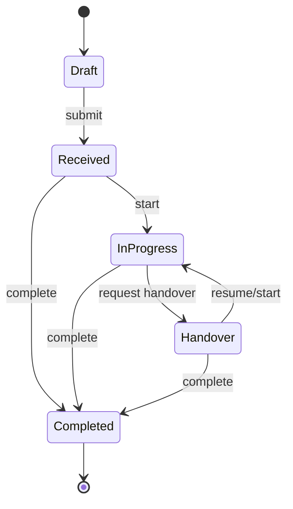

# Domain guide

Last verified: 2026-07-30

This document records current business behavior. Recommendations and open operational decisions
live in the other documents.

## Product language

iianka is an internal Japanese-language operations application. Code identifiers and technical
documentation are primarily English; user-facing labels, validation messages, and workflows are
primarily Japanese.

| Product term                       | Meaning                                                                                                                  |
| ---------------------------------- | ------------------------------------------------------------------------------------------------------------------------ |
| Construction schedule              | A dated field-work plan with status, people, subcontractors, site guides, voucher confirmation, and optional stock usage |
| Business schedule                  | A dated non-construction plan shown in common schedule views                                                             |
| Internal notice                    | A dated announcement assigned to users                                                                                   |
| Cleaning duty rule                 | A recurring weekday duty assigned to users                                                                               |
| Construction site                  | The UI name for a `SiteGuideFile`; it is a guide file, not a separate site entity                                        |
| Reception / 受付                   | Intake cases from draft through assignment, work, handover, and completion                                               |
| Reception document type / 案件書類 | Ordered master data classifying reception cases                                                                          |
| Stock term                         | Accounting period from the 21st of one month through the 20th of the next                                                |
| Voucher confirmation / 伝票確認    | A check timestamp, checker, and note on eligible construction schedules                                                  |
| Business date                      | The current calendar date in `Asia/Tokyo`, independent of Laravel's UTC timezone                                         |

## Users, roles, and visibility

`UserRole` has three roles:

| Capability                                                                                    |                  Admin |                 Editor |                 Viewer |
| --------------------------------------------------------------------------------------------- | ---------------------: | ---------------------: | ---------------------: |
| View schedule/content collections                                                             |                    Yes |                    Yes |                    Yes |
| Manage schedules, notices, attendance, guide files, cleaning rules, and reception master data |                    Yes |                    Yes |                     No |
| Manage stock catalog and purchases                                                            |                    Yes |                     No |                     No |
| Manage users                                                                                  |                    Yes |                     No |                     No |
| View audit logs                                                                               |                    Yes |                     No |                     No |
| Create a reception draft                                                                      |                    Yes |                    Yes |                    Yes |
| Work on an assigned active reception case                                                     | Policy/state dependent | Policy/state dependent | Policy/state dependent |

The role helpers in `App\Models\User` and gates in `AppServiceProvider` are authoritative:

- `manage-content`: Admin and Editor.
- `view-all-content`: Admin, Editor, and Viewer.
- `manage-users`, `manage-stocks`, `view-audit-logs`: Admin only.

`is_hidden_from_workers` does not create a fourth role. It removes a user from normal worker and
reception-assignee option queries. Existing relationships and administrative access still use the
same user row.

## Scheduling and internal communication

### Construction schedules

Construction status values:

| Value       | Meaning   |
| ----------- | --------- |
| `scheduled` | Scheduled |
| `confirmed` | Confirmed |
| `postponed` | Postponed |
| `canceled`  | Canceled  |

Voucher confirmation is required for every status except `postponed` and `canceled`. Eligibility
is centralized in `ConstructionSchedule::requiresVoucherConfirmation()`.

Key invariants:

- A schedule may have many assigned users, site guide files, and subcontractors.
- Subcontractors use soft deletes. Historical schedule relations include soft-deleted records.
- Schedule numbers are ordered/indexed with the date but are not database-unique.
- General contractor is stored as text on each schedule. The `general_contractors` table is a
  unique suggestion catalog, not a normalized parent.
- New or replacement site guide files are stored on the private `local` disk.
- The status and voucher fields are independent from reception status.
- Construction schedule content participates in stock reconciliation; business schedule content
  currently does not.

### Business schedules

Business schedules share date, time, personnel, location, contractor, responsible person, content,
memo, number, and assigned-user concepts with construction schedules. They do not have
construction status, site guides, subcontractors, voucher confirmation, or current stock
reconciliation.

### Calendar, search, and attention counts

The schedule calendar combines:

- Construction schedules.
- Business schedules.
- Internal notices.
- Active cleaning-duty occurrences.

Schedule search searches construction and business schedules. Shared Inertia `attention` counts
provide today's combined schedule count, pending voucher count, and internal-notice count. Users
without all-content permission would be limited through their assignments, though all three
current roles receive `view-all-content`.

### Attendance

There is at most one attendance row per user and work date. Supported statuses are `working` and
`leave`. Attendance leave data is also used when building schedule availability.

### Business date

Laravel runs in UTC, while `BusinessDate::today()` evaluates the calendar date in `Asia/Tokyo`.
Use the business date for:

- Default schedule dates and "today" filters.
- Reception daily case-number sequences.
- Current stock accounting term.
- Date-sensitive attention counts.

Do not replace it with a bare UTC `today()` call.

## Reception workflow

### Case identity

Case numbers follow:

```text
WJA-C-YYYYMMDD-NNNN
```

The date is the `Asia/Tokyo` business date. `reception_case_sequences` keeps one locked counter per
date, and `reception_cases.case_number` is unique.

### Status state machine



Application values are `draft`, `received`, `in_progress`, `handover`, and `completed`.
`received`, `in_progress`, and `handover` are active states.

Additional transition rules:

- Entering `in_progress` requires an assignee.
- Workflow transitions run in a database transaction with `lockForUpdate`.
- Repeating a transition already applied is treated as an idempotent success.
- A request that lost a race to an incompatible state returns a stale-state result.
- Every applied transition writes a case activity and schedules an audit event after commit.
- Status changes must go through `ReceptionCaseWorkflow`; do not update the status directly.

### Permissions by case state

| Action                              | Current policy                                                                 |
| ----------------------------------- | ------------------------------------------------------------------------------ |
| View active/completed case          | Any authenticated user                                                         |
| View, edit, submit, or delete draft | Draft creator only                                                             |
| Create draft                        | Any authenticated user                                                         |
| Edit active intake fields           | Original receptor or content manager                                           |
| Change priority                     | Content manager; active/non-completed, never a draft                           |
| Assign                              | Content manager while case is active                                           |
| Start/resume                        | Content manager from `received` or `handover`; model also requires an assignee |
| Add/remove attachments              | User allowed to edit, or assigned user while active                            |
| Update work memo                    | Assigned user or content manager while active                                  |
| Request handover                    | Assigned user or content manager while `in_progress`                           |
| Complete from `in_progress`         | Assigned user or content manager                                               |
| Complete from `received`/`handover` | Content manager                                                                |
| View archive                        | Any authenticated user                                                         |

### Priority, activity, and seen state

Priority values are `normal`, `middle`, and `high`. Priority-aware lists order high, then middle,
then normal within their other list grouping rules.

Activities capture:

- Activity type.
- Actor.
- Optional memo.
- From/to status.
- From/to assignee snapshots.

`last_activity_at` is the freshness marker. A seen-state row is unique per case and user.
`markSeenBy()` records seen state only for the current assignee.

### Attachments

Reception cases may contain documents, images, audio, and video from upload, capture, or recording
sources.

Current limits:

- 20 total attachments per case.
- 10 recordings per case.
- 10 minutes per recording.
- 50 MiB per file.

The server validates extension, detected MIME type, size, source/kind compatibility, and recording
duration. Files are stored on the private `local` disk and downloaded or previewed only through an
authorized controller. Deleting an attachment or case removes the stored file.

## Stock

### Source of inventory truth

`stocks.current_quantity` is the materialized current balance. `stock_transactions` is the
immutable audit ledger explaining every balance change.

Never:

- Update or delete an existing ledger row.
- Change `current_quantity` without recording the corresponding ledger delta inside the same
  transaction.
- Delete a stock that is still referenced by purchases, mentions, balances, or transactions.

Use `ScheduleStockReconciliationService` and `StockPurchaseRecorder` for their respective flows.

### Catalog and parsing

Each stock has a globally unique normalized current name. Aliases also have globally unique
normalized values. Active names and aliases form the parser catalog.

The construction content editor provides a slash-command picker, but the backend parser remains
authoritative. Parser version `1.0.0`:

- Matches current names and aliases with Unicode-aware normalization.
- Prefers the longest safe match.
- Requires a positive quantity near the mention.
- Allows fractional quantities only for stocks configured to permit them.
- Records mention offsets, identification method, and status.
- Does not fuzzy-match unknown words.

### Reconciliation

On construction schedule create/update:

1. Lock the schedule and compare its content hash/version.
2. Parse current content.
3. Lock existing per-stock balances.
4. Lock affected stocks in ascending ID order.
5. Validate inactive-stock and numeric-range rules.
6. Persist a content revision and mention rows when needed.
7. Write only the inventory delta to the immutable ledger.
8. Update `stocks.current_quantity`.
9. Upsert or remove active `schedule_stock_balances`.
10. Update content hash, version, extraction status, and timestamp.

Identical content is a no-op. Stale content versions roll back the entire request. Deleting a
construction schedule reverses its applied quantities but retains revisions, mentions, and ledger
history. Inventory is allowed to become negative, within the `decimal(12,3)` value-object range.

### Inactive stock

- New or increased schedule usage is rejected.
- Decreased schedule usage is allowed so existing usage can be unwound.
- Purchase increases are rejected.
- Purchase decreases are allowed.
- Inactive stocks remain reportable when they have values in visible terms.

### Accounting terms and reports

A stock term runs from the 21st through the 20th of the following month. Usage report buckets are:

1. 21st through month end.
2. 1st through 10th.
3. 11th through 20th.

There is one purchase total per stock and term. Editing it records only the difference in the
ledger. Reports separate purchases, schedule usage, adjustments, carry-over, and closing balance.

## Audit behavior

Audit logs cover authentication, authorization denials, admin changes, schedule/content changes,
reception workflow activity, file access, stock operations, and passkeys.

An audit row may retain a generic subject type and ID after its actor or subject model changes.
Sensitive metadata keys are recursively redacted. Audit logging is best-effort and cannot be used
as the transaction commit signal; the business table remains the primary source of success.

## Domain change checklist

When changing a rule:

1. Change the enum/value object/application workflow that owns it.
2. Keep HTTP validation and authorization aligned.
3. Update shared Inertia labels/props rather than duplicating PHP enum values in React.
4. Add focused unit tests for pure rules and feature tests for persistence/authorization.
5. Update this guide and the ERD if storage changed.
