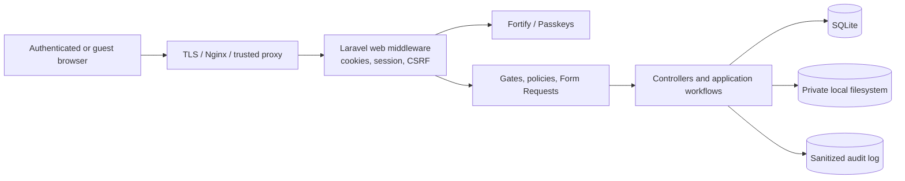

# Security and access control

Last verified: 2026-07-30

## Trust boundaries

The application is a session-authenticated web app. It has no bearer-token API and no public
business endpoints.

## Authentication model

| Concern                   | Current implementation                                                                                                           |
| ------------------------- | -------------------------------------------------------------------------------------------------------------------------------- |
| Guard/provider            | `web` session guard with Eloquent `User` provider                                                                                |
| Login identifier          | Case-normalized `login_id`, not email                                                                                            |
| Registration              | Disabled; `Features::registration()` is not enabled                                                                              |
| Account creation          | Admin user UI and `php artisan admin:create-user`                                                                                |
| Password reset            | Enabled; email is optional on users, so only users with usable email can receive it                                              |
| Two-factor authentication | Enabled, confirmation and password confirmation required                                                                         |
| Passkeys                  | Enabled, password confirmation required for registration/deletion                                                                |
| Session storage           | Database locally; Redis in intended production configuration                                                                     |
| Login limiter             | Five attempts/minute per normalized login ID and IP                                                                              |
| Two-factor limiter        | Five attempts/minute per pending login session                                                                                   |
| Passkey limiter           | Five attempts/minute per IP                                                                                                      |
| Password policy           | Laravel default locally; in production minimum 12 characters with mixed case, letters, numbers, symbols, and uncompromised check |

The user model hides password, two-factor secret, recovery codes, and remember token from
serialization. Passwords use Laravel's hashed cast. Passkeys cascade when a user is deleted.

### Email verification decision

Fortify's email-verification feature and routes are enabled, and most business routes carry the
`verified` middleware. However, `App\Models\User` does not implement
`Illuminate\Contracts\Auth\MustVerifyEmail`.

Laravel's verification middleware only enforces verification for users implementing that
contract. Therefore, the current `verified` middleware does not require this user model to verify
an email.

This needs an explicit product decision:

- If optional email and administrator-created accounts are intentional, document that
  `verified` is compatibility scaffolding and consider removing misleading verification UI/routes.
- If verified email is required, implement the contract, decide how email-null users are handled,
  migrate existing accounts, and extend the auth tests before enabling enforcement.

Do not assume route middleware alone currently proves email ownership.

## Authorization model

Business routes are grouped behind `auth` and usually `verified`. Authentication is necessary but
not sufficient:

- Role-derived gates protect content, user, stock, and audit administration.
- Reception policies apply state-, ownership-, and assignment-aware rules.
- Form Requests authorize mutations in addition to validating them.
- Controllers use gates or policies for read and mutation endpoints.
- The React permission payload controls presentation only. Backend authorization remains
  authoritative.

See the complete role and reception action matrices in the
[domain guide](domain-guide.md#users-roles-and-visibility).

When adding an endpoint:

1. Put it in the correct authenticated route group.
2. Use a Form Request for any mutation.
3. Authorize server-side with an existing or new gate/policy.
4. Test allowed and denied roles/ownership/state.
5. Use a named route and generated Wayfinder helper on the frontend.

## Request, cookie, and proxy controls

- Laravel's web middleware provides sessions and CSRF protection.
- Appearance and sidebar cookies are intentionally excluded from encryption; they contain UI
  preferences, not credentials.
- Session cookies default to HTTP-only and `SameSite=Lax`.
- Production configuration must set secure cookies and isolate staging/production cookie domains.
- `PreventSearchEngineIndexing` is globally appended, and `robots.txt` returns `Disallow: /`.
- Forwarded headers are trusted from `*`. Nginx/firewall configuration must prevent untrusted
  clients from bypassing or spoofing the trusted proxy boundary.
- A generated request ID is placed in request/context state and copied into audit logs.

## File security

### Reception attachments

- Stored on the private `local` disk.
- Served through reception attachment routes after policy authorization.
- Extension and server-detected MIME type must agree.
- Source-specific rules restrict camera capture and audio recording.
- Size, count, recording count, and duration are bounded.
- Browser filenames are sanitized for `Content-Disposition`.
- Model deletion removes the stored object.

### Site guide files

- New and replacement files are explicitly stored on the private `local` disk.
- The download route requires an authenticated user and emits an audit event.
- Store/update requires content-manager permission.
- Accepted formats are PDF, JPEG, PNG, WebP, HEIC, and HEIF, up to 50 MiB.
- The database column retains a historical default of `public`; application code must continue to
  force `local`, and legacy data should be checked before enabling `public/storage`.

Never expose `storage/app/private` through Nginx or a public symlink.

## Audit logging

`AuditLogger` records event/outcome, actor, subject snapshot, request metadata, and sanitized
metadata. Sensitive keys containing password, token, secret, recovery, or credential are
redacted recursively. Uploaded files are represented by name, MIME type, and size rather than
contents.

Authentication listeners cover attempts, success/failure, lockout, logout, password reset,
verification, 2FA, recovery codes, and passkeys. A global exception response hook records 403
denials.

Audit writes are deliberately best-effort. A failure is written to the application log and does
not abort the original action. Monitor application logs if audit completeness is a compliance
requirement.

## Secrets and production configuration

- Commit only `.env.example`; never commit environment files, database files, private keys,
  passkey secrets, or backup credentials.
- Generate distinct `APP_KEY` and passkey secrets per environment.
- Set `APP_DEBUG=false` outside local development.
- Use environment-specific session cookie domains and Redis databases.
- Configure real SMTP before relying on password-reset or verification mail.
- Keep SQLite and private storage outside the web root and on local, not network, storage.
- Do not run `DatabaseSeeder` in production; it creates demonstration accounts with known
  passwords.
- Run `composer security` and review the CI taint/audit jobs before release.

## Security change checklist

1. Identify guest, authenticated, role, ownership, assignment, and state boundaries.
2. Normalize input before validation and use `$request->validated()` or `$request->safe()`.
3. Add server-side authorization; UI visibility is not authorization.
4. Use bound query parameters and Eloquent/query builder.
5. Validate upload extension, MIME, size, count, and storage disk.
6. Avoid secrets or raw credentials in logs, flashes, exceptions, and Inertia props.
7. Add success and denial tests, including cross-user access.
8. Run focused tests, static analysis, taint analysis for sensitive changes, and dependency audits.
9. Update this document and the domain guide.
